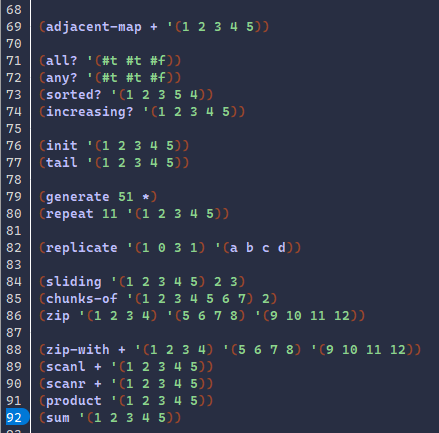

# Exploration Activity 02 Overview
### Racket | Library: *algorithms*
## What is Racket/Algorithms?
Algorithms, by codereport is a short, but immesearably usefull package that grants a variety of usefull list manipulation, testing, and generating functions that racket lacks. 

Many of the functions such as adjacent-map, all?, any?, chunks-of, etc. are based on their own counterparts in other languages such as Python and Haskell. Each function has limited variation in options so they are less flexible but also incredibly simple to use.

The most common parameters used by the functions are *proc*, *lst*, and *constants*.
> proc: A process applied to the list such as +, *, /, and -
> lst: A list of elements. Most functions work with lists of number but others work with booleans
> constants: Used to state how large group sizes are, a value, the size of the created list, etc.

## Details
The Algorithms package was made by codereport and is protected by the MIT license. It was created on the 17th of May 2020, and is still being updated to this day.

## Functions of the Package

The package has a variety of algorithms that can be split into X categories
# Manipulation
A large amount of the functions of the Algorithms package are dedicated to manipulating lists. They would either sort the lists while applying the relevant *proc* to them, removing parts of them, or applying some operation to all of the elements to each other. These functions are:
> (adjacent-map *proc lst*)
> (init *lst*)
> (tail *lst*)
> (scanl *proc lst*)
> (scanr *proc lst*)
> (product *lst*)
> (sum *lst*)

# Testing
Some of the functions are dedicated to determining if the list is sorted or whether some, or all, of it is true.
> (all? *lst-of-booleans*)
> (any? *lst-of-booleans*)
> (sorted? *lst*)
> (increasing? *lst*)

# Merging and Splitting
Some of the most complex algorithms are dedicated to splitting lists or merging multiple lists.
> (repeat *n val*)
> (replicate *lst1 lst2*)
> (sliding *lst size slides*)
> (chunks-of *lst group-size*)
> (zip *lst1 lst2 lst3 . . .*)
> (zip-with *proc lst1 lst2 lst3 . . .*)

# Generation
The package only has one function dedicated solely to creating a list from nothing and it is the Generate function. 
> (generate *n proc*)
It generates a list of *N* elements from invoking its *proc N* times.

## Why this?
Algorithms are a cornerstone of the creation of programs. While a program can be made without the use of programs, the vast majority of them will have at least one. Whether the algorithms are created by the programmer or imported from a package, it will be immensely usefull. So finding this class for Racket, a complex language with hard to understand documentation, was a great find. The package is sleek and simplistic with easy to understand documentation, reliable quality, and functions that were extremely easy to make use of.
1. Which package/library did you select?
2. What is the package/library?
• What purpose does it serve?
• How do you use it?
• This section should be the largest and go into lots of detail. Not everything here must
be utilized in your sample program.
3. What are the functionalities of the package/library?
• Snippets of code and examples of output should be given here.
4. When was it created?
5. Why did you select this package/library?
• “Because it is interesting” is not a valid answer. Should elaborate more.
6. How did learning the package/library influence your learning of the language?
7. How was your overall experience with the package/library?
• When would you recommend this package/library to someone?
• Would you continue using this package/library? Why or why not?