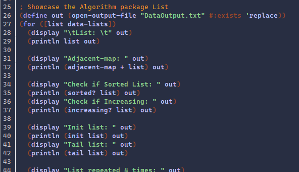
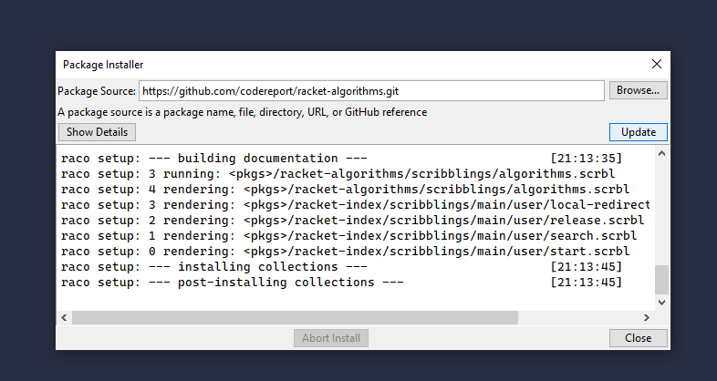
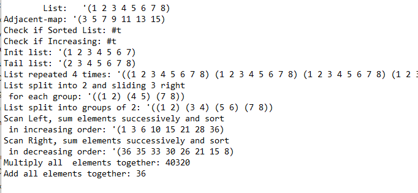

# Exploration Activity 02
### Racket | Library: *algorithms*
The library Algorithms is made for racket and has a variety of functionalities relating to lists, manipulating lists, and sorting lists. The sample program showcases most of the functions that are provided by the package such as adjacent-map, product, repeat, scanl and scanr, and a few more.

## How to Run the Sample Program
Cloning the source folder should be sufficient. From DrRacket you will be able to easily run the program by selecting Run. The Output and Input files are kept in the source folder.
> to Install open DrRacket: select *File->Install* and paste the package's github repository link and select install. (Algorithms github repository link: https://github.com/codereport/racket-algorithms.git)

# Sample Input and Output
The sample input and output files are already included with the program in text files. The input file has 7 lines of numbers, separated with commas. The program reads them in, converts them into lists, and applies some functions from the algorithms package on them and pasting the results into the DataOutput.txt file.

